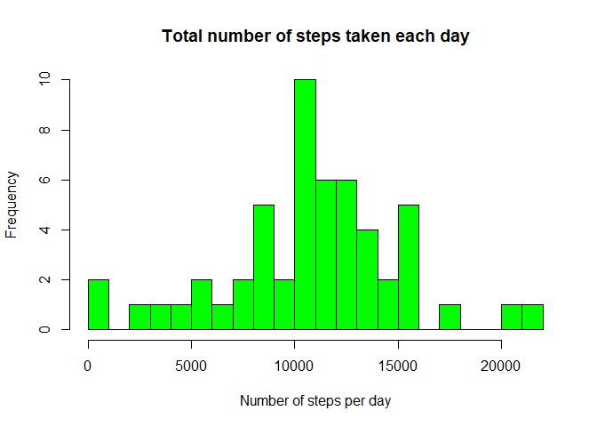
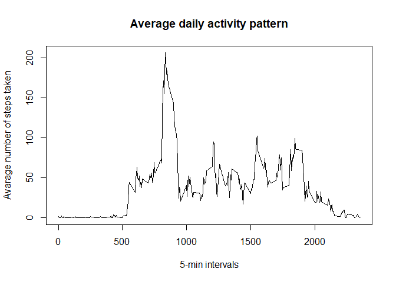
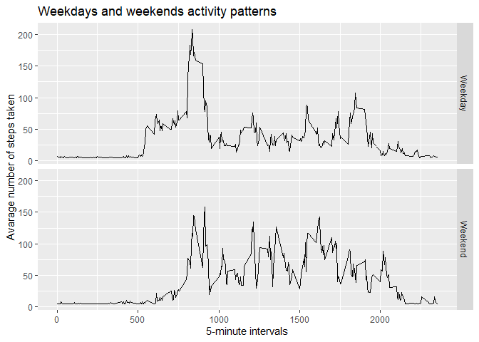

## Loading and preprocessing the data


```r
raw_data <- read.csv("activity.csv", header = TRUE)
main_data <- na.omit(raw_data)
```

## What is mean total number of steps taken per day?


```r
steps_per_day <- aggregate(main_data$steps, by = list(Steps.Date = main_data$date), FUN = "sum")
hist(steps_per_day$x, col = "green", breaks = 20, main = "Total number of steps taken each day", xlab = "Number of steps per day")
```

<!-- -->

```r
mean_steps <- mean(steps_per_day[,2])
print (mean_steps)
```

```
## [1] 10766.19
```

## What is the average daily activity pattern?


```r
avaraged_day <- aggregate(main_data$steps, by = list(Interval = main_data$interval), FUN = "mean")
plot(avaraged_day$Interval, avaraged_day$x, type = "l", main = "Average daily activity pattern", ylab = "Avarage number of steps taken", xlab = "5-min intervals")
```

<!-- -->

## Imputing missing values

```r
NA_number <- length(which(is.na(raw_data$steps)))
print (NA_number)
```

```
## [1] 2304
```

```r
library(Hmisc)
raw_data_filled <- raw_data
raw_data_filled$steps <- impute(raw_data$steps, fun=mean)
```


## Are there differences in activity patterns between weekdays and weekends?


```r
raw_data_filled$date <- as.Date(raw_data_filled$date)
raw_data_filled$weekday <- weekdays(raw_data_filled$date)
raw_data_filled$day_type <- ifelse(raw_data_filled$weekday=="Saturday" |                                   raw_data_filled$weekday=="Sunday","Weekend","Weekday")
raw_data_filled$day_type <- factor(raw_data_filled$day_type)
day_types_data <- aggregate(steps ~ interval + day_type, data=raw_data_filled, mean)
library(ggplot2)
ggplot(day_types_data, aes(interval, steps)) + geom_line() + facet_grid(day_type ~ .) + xlab("5-minute intervals") + ylab("Avarage number of steps taken") + ggtitle("Weekdays and weekends activity patterns")
```

<!-- -->
